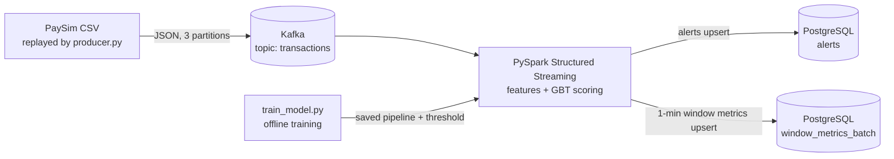

# Real-Time Fraud Detection Pipeline

A streaming pipeline that scores payment transactions for fraud as they arrive.
Transactions flow through **Kafka**, are scored by a **Spark ML gradient-boosted-trees** model inside
**PySpark Structured Streaming**, and alerts plus 1-minute metrics land in **PostgreSQL**.
Everything runs locally with **Docker Compose**.

> **Status:** work in progress. The results table below is filled from `models/metrics.json` after you run training.

## Architecture



## Highlights

- **Dataset:** PaySim synthetic mobile-money transactions (~6.36M rows, ~8.2K fraud, fraud only in `TRANSFER` and `CASH_OUT`).
- **Time-based split, no leakage:** train on `step <= 500`, choose the alert threshold on `501-620`, report final numbers on `>= 621`. The stream replays only the held-out period.
- **Threshold by business value, not accuracy:** the alert threshold maximises *net saving* = fraud value stopped − (review cost × number of alerts), and is benchmarked against a static rule (`TRANSFER` with amount > 200,000).
- **Shared feature code:** the same `add_features()` function is used for training and streaming, which avoids train/serve skew. Features include balance-error terms and an "origin account emptied" flag.
- **Reliable by design:** Structured Streaming checkpoints track Kafka offsets; each micro-batch is written in a single PostgreSQL transaction with `ON CONFLICT` upserts, so a replayed micro-batch overwrites its own rows instead of duplicating them.
- **Class imbalance:** all fraud rows kept, normal rows downsampled (default 10%) for training; validation and test stay at the true ratio.

## Results

   Test period only (steps 621 and later):

| Strategy | Alerts | Fraud caught | Precision | Recall | Fraud value stopped | Review cost | Net saving |
|---|---|---|---|---|---|---|---|
| Static rule (TRANSFER, amount > 200,000) | 6,409 | 453 / 1,366 | 0.071 | 0.332 | 1,172,044,129 | 64,090 | 1,171,980,039 |
| GBT model (threshold 0.10) | 1,364 | 1,364 / 1,366 | 1.000 | 0.999 | 2,340,344,242 | 13,640 | 2,340,330,602 |

AUC-PR (test): 0.9993

Amounts are in PaySim's simulated currency units. Near-perfect scores are typical for PaySim, whose fraud follows a simple, learnable pattern (drained accounts, balances that don't add up). Real-world fraud is much harder, so treat this as a pipeline demonstration, not a claim about production accuracy.
## Project structure

```
fraud-detection/
├── docker-compose.yml      # Kafka (KRaft, 3 partitions), PostgreSQL, and an `app` container for the Python jobs
├── Dockerfile              # Python 3.11 + Java 17 + PySpark 3.5
├── requirements.txt
├── sql/init.sql            # tables: alerts, window_metrics_batch + view window_metrics_1m
├── data/                   # put the PaySim CSV here (git-ignored)
├── models/                 # trained pipeline, threshold, metrics (git-ignored)
└── src/
    ├── config.py           # paths, Kafka/Postgres settings, split steps, review cost
    ├── spark_session.py
    ├── features.py         # schemas + feature engineering (shared by train and stream)
    ├── train_model.py      # train, pick threshold, compare to baseline
    ├── producer.py         # replays transactions into Kafka
    └── stream_job.py       # Kafka -> score -> PostgreSQL
```

## Quick start

**Requirements:** Docker Desktop (give it at least 6 GB RAM). No local Python, Java or Spark needed.

1. **Get the data.** Download the PaySim dataset from Kaggle ("Synthetic Financial Datasets For Fraud Detection") and put the CSV inside `data/`.
2. **Start Kafka and PostgreSQL**
   ```bash
   docker compose up -d
   ```
3. **Train the model** (writes `models/`)
   ```bash
   docker compose run --rm --no-deps app python src/train_model.py
   ```
4. **Start the streaming job** (leave it running in its own terminal)
   ```bash
   docker compose run --rm app python src/stream_job.py
   ```
5. **Start the producer** (second terminal)
   ```bash
   docker compose run --rm app python src/producer.py --rate 500
   ```
6. **Look at the output**
   ```bash
   docker exec -it fraud-postgres psql -U fraud -d fraud
   ```
   ```sql
   SELECT * FROM window_metrics_1m ORDER BY window_start DESC LIMIT 10;
   SELECT txn_id, txn_type, amount, round(fraud_prob::numeric, 3) AS prob, is_true_fraud
   FROM alerts ORDER BY fraud_prob DESC LIMIT 20;
   ```

Useful producer flags: `--rate 0` (as fast as possible), `--limit 50000` (short demo), `--min-step 1` (replay everything).

## Testing the reliability claim

1. Run steps 4 and 5, wait for a few batches, then stop the stream job with Ctrl+C.
2. Start it again: it resumes from the checkpoint and does not reprocess committed batches.
3. Check for duplicates, which should return zero rows:
   ```sql
   SELECT txn_id, COUNT(*) FROM alerts GROUP BY txn_id HAVING COUNT(*) > 1;
   ```

## Configuration

| Setting | Where | Default |
|---|---|---|
| Review cost per alert | `REVIEW_COST` env var / `config.py` | 10 |
| Train / validation split steps | `config.py` | 500 / 620 |
| Normal-row sampling for training | `NEG_KEEP_FRACTION` | 0.1 |
| Spark driver memory | `SPARK_DRIVER_MEMORY` | 4g |

## Design notes and limitations

- **Windows use Kafka's ingest timestamp**, not PaySim's `step` (which is an hour index). Metrics are therefore per replay-minute.
- **Per-batch metric rows** are keyed by `(window_start, batch_id)` so retries are idempotent; the view `window_metrics_1m` sums them. A true stateful window aggregation with watermarks would be the next step.
- **PaySim is synthetic**, and the `isFraud` label is known at scoring time, which lets the stream report precision/recall live. A real system would receive labels late.
- The review cost (10) is an assumption; change it to see how the best threshold moves.
- Single-node Kafka and Spark `local[*]` — a learning/portfolio setup, not a production deployment.

## Ideas for next steps

- Dashboard (Grafana or Streamlit) on top of `window_metrics_1m` and `alerts`
- Stateful per-account features (velocity, rolling counts)
- Model monitoring and drift checks; scheduled retraining
- Run Spark on a real cluster

## Dataset credit

PaySim: E. A. Lopez-Rojas, A. Elmir, S. Axelsson, "PaySim: A financial mobile money simulator for fraud detection", 2016.

## License

MIT
